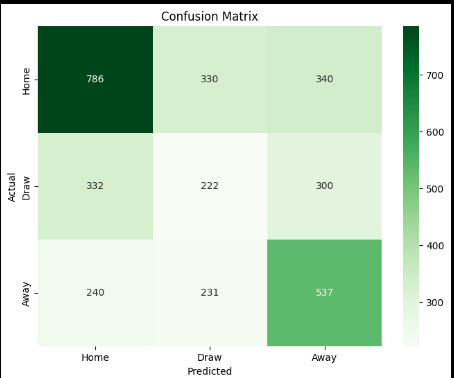

# Football Match Outcome and Goal Prediction

This repository contains code and analysis for my project on exploring football dataset and predicting football match outcomes. 

## Table of Contents
* [Project Description](#project-description)
* [Getting Started](#getting-started)
  * [Prerequisites](#prerequisites)
  * [Installation](#installation)
* [Data](#data)
* [Analysis](#analysis)
* [Conclusions and Future Work](#conclusions-and-potential-improvements)

## Project Description
In this project, I explore various factors that could influence the outcome of a football match. The analysis aims to:
* Improve domain knowledge of football and football betting.
* Develop machine learning models to predict match outcomes and the number of goals scored.

## Getting Started

### Prerequisites
This project requires Python 3.8+ and the following Python libraries installed:
* Numpy
* Pandas
* Matplotlib
* Seaborn
* Scipy
* Scikit-Learn
* Imbalanced-Learn
* Statsmodels

### Installation
1. Clone this repository.
2. Install the prerequisites via pip:
   ```bash
   pip install -r requirements.txt
   ```

## Data
The project uses the "Ultimate 25k+ Matches Football Database" dataset from Kaggle: [https://www.kaggle.com/datasets/prajitdatta/ultimate-25k-matches-football-database-european].
It contains information on 11 European football leagues for 2008-2016 with matches, players, teams, as well as team and player attributes from FIFA games.

## Analysis
The analysis is contained in a Jupyter Notebook analysis.ipynb and includes:
* Data Cleaning and Transformation
* Exploratory Data Analysis
* Statistical Inference
* Prediction Models

## Conclusions and Potential Improvements
* Predicting the precise number of goals a team will have in a match does not seem achievable with the data we have. Efforts should be put elsewhere.
* Prediction of football match outcomes (Home team win, Away team win, Draw) can be achieved to a similar degree of other betting companies. Competitors reached accuracy of ~53%, while our linear model achieved an accuracy of 47% on the test set.



Classification Report for Test Data (2015/2016):

|            | precision | recall | f1-score | support |
|------------|-----------|--------|----------|---------|
| Home       | 0.58      | 0.54   | 0.56     | 1456    |
| Draw       | 0.31      | 0.29   | 0.30     | 854     |
| Away       | 0.46      | 0.53   | 0.49     | 1008    |
|            |           |        |          |         |
| accuracy   |           |        | 0.47     | 3318    |
| macro avg  | 0.45      | 0.45   | 0.45     | 3318    |
| weighted avg | 0.47    | 0.47   | 0.47     | 3318    |


Note:
> This project was done prior to learning other Machine Learning algorithms. Better performance could be achieved by using more complex algorithms or better feature engineering.
